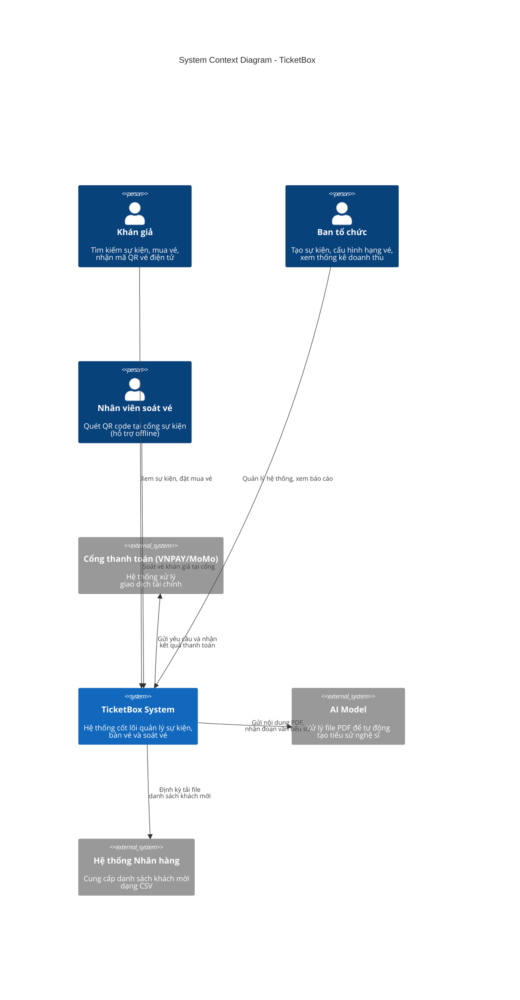
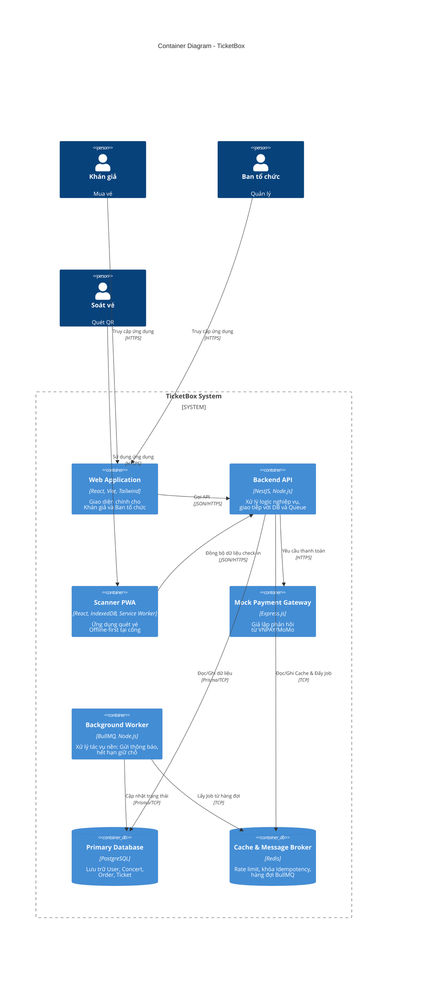
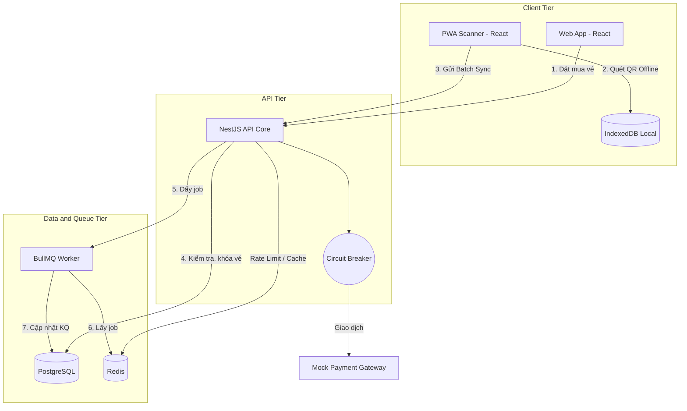
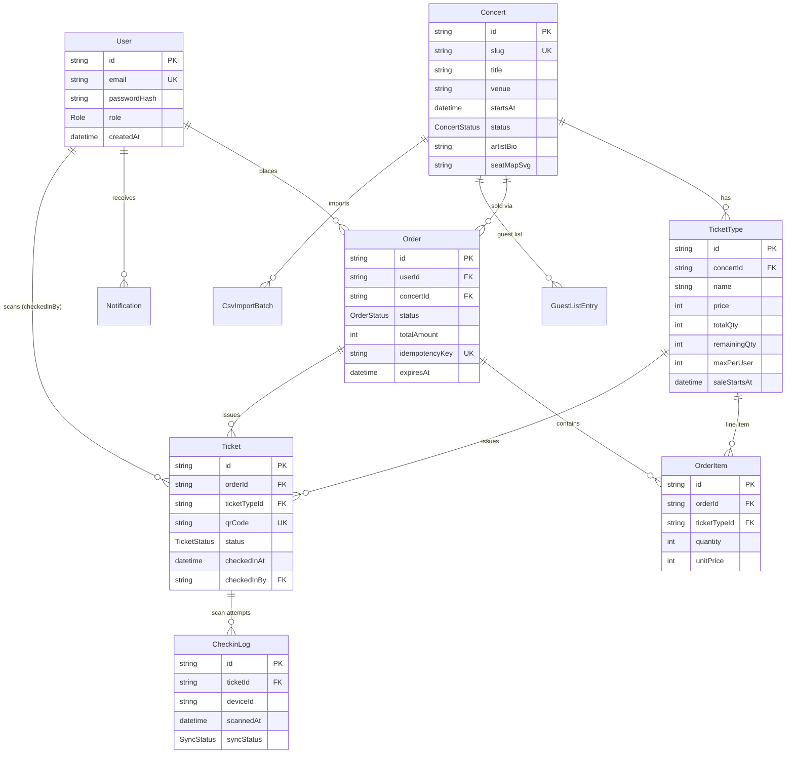
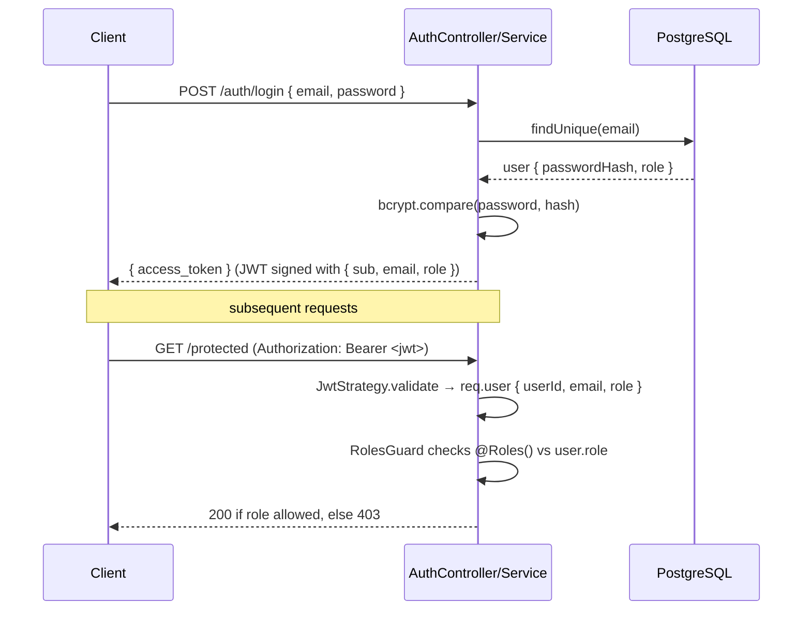

# TicketBox System Architecture Design

> Stack: NestJS + Prisma + PostgreSQL + Redis · React (Vite) for web/scanner.

## 1. C4 Model - Level 1: System Context Diagram
Sơ đồ này thể hiện hệ thống TicketBox tương tác với các nhóm người dùng và các hệ thống bên ngoài.

### 1.1. C4 Model - Level 2: Container Diagram

### 1.2. Request Flow Diagram (Runtime View)

## 2. Database Design

PostgreSQL is the single source of truth. Prisma manages the schema and migrations
(`src/backend/prisma/schema.prisma`). All primary keys are UUIDs so IDs can be
generated client-side and never collide across services.

### Entity-Relationship Diagram

### Design decisions

- **Stock as a counter, not per-seat rows.** `TicketType.remainingQty` is decremented
  atomically on reservation. This keeps the high-contention purchase path to a single
  row update instead of inserting thousands of seat rows up front. The concurrency-safe
  decrement (`UPDATE ... WHERE remainingQty >= qty`) is the Week 2 graded mechanism — see
  [specs/purchase.md](specs/purchase.md).
- **`Order.expiresAt` lives on the order**, because the reservation (the `remainingQty`
  hold) is owned by the order, not the ticket type. A BullMQ sweeper (Person B) releases
  expired holds. See the reservation model in [specs/purchase.md](specs/purchase.md).
- **`Ticket.qrCode` is globally unique** so the scanner can resolve a ticket from the QR
  payload alone, offline-first.
- **`CheckinLog` is append-only** (every scan attempt is logged, including rejected
  duplicates) for the audit trail and the "2 devices offline" demo. The double check-in
  guard is enforced by a _partial_ unique index, not a plain unique — final choice is
  documented in [specs/checkin.md](specs/checkin.md) (Person C).
- **`GuestListEntry` dedup** uses `@@unique([concertId, docId, sourceBatchId])`. Because
  PostgreSQL treats NULLs as distinct, NULL-safe dedup for guests without a `docId` is
  handled in application code (Person B's CSV ingestion).
- **Indexes** back every foreign key used in hot reads (`TicketType.concertId`,
  `Order(userId, concertId)`, `OrderItem.orderId/ticketTypeId`, `CheckinLog.ticketId`).
- **Cascade deletes** flow Concert → TicketType / GuestListEntry / CsvImportBatch and
  Order/OrderItem so wiping a draft concert never strands child rows. `Ticket.checkedInBy`
  is `ON DELETE SET NULL` to preserve issued tickets if a scanner account is removed.

### Enums

`Role(AUDIENCE, ORGANIZER, SCANNER)`, `ConcertStatus(DRAFT, ON_SALE, CANCELLED)`,
`OrderStatus(PENDING, PAID, FAILED, EXPIRED)`, `TicketStatus(VALID, USED, CANCELLED)`,
`SyncStatus(PENDING, SYNCED, ACCEPTED, FAILED)`, `ImportStatus(PROCESSING, SUCCESS, FAILED)`,
`NotificationStatus(PENDING, SENT, FAILED)`, `GuestStatus(INVITED, CHECKED_IN)`.

---

## 3. Authentication & RBAC (Person A)

JWT bearer tokens, stateless. Passwords are bcrypt-hashed at rest. Three roles map to the
three apps: `AUDIENCE` → web browsing/purchase, `ORGANIZER` → admin, `SCANNER` → scanner app.

### Flow

### Components

- **AuthService** — `register()` bcrypt-hashes the password and stores the user;
  `login()` verifies the password and signs a JWT with payload `{ sub, email, role }`.
- **JwtStrategy** — extracts the bearer token, verifies signature/expiry against
  `JWT_SECRET`, attaches `{ userId, email, role }` to the request.
- **`@Roles(...)` decorator + RolesGuard** — declarative endpoint protection. `RolesGuard`
  reads the `roles` metadata via `Reflector`; absence of metadata means the route is open
  to any authenticated user. `JwtAuthGuard` (Passport `'jwt'`) runs first to populate
  `req.user`.

Full behaviour, error cases, and acceptance criteria: [specs/auth.md](specs/auth.md).

---

## Mechanisms (Person B)

### 2. Rate Limiting

- **Implementation**: Token Bucket pattern via Redis.
- **Why**: Protect against traffic spikes (e.g. 80k requests/5m).
- **ADR**: We chose Redis Token Bucket over memory caching to support horizontal scaling later, and to apply accurate rate limiting per IP/user identifier globally.

### 3. Circuit Breaker

- **Implementation**: Mock gateway wrapped by a Circuit Breaker middleware.
- **Why**: Handles payment gateway failure gracefully without blocking concert listing.
- **ADR**: Selected `opossum` for Node.js circuit breaker. We could have used native try-catch logic but `opossum` implements a robust Open/Half-Open/Closed state machine.

### 7. Caching

- **Implementation**: Cache-aside with Redis.
- **Why**: DB load reduction for highly concurrent read endpoints (e.g., concert list and detail).
- **ADR**: Selected Cache-aside over Read-through because of NestJS + Prisma constraints, and because we only need to cache hot data with a relatively short TTL. Explicit invalidation is done upon ticket purchase.

### 4. Idempotency (For Payment)

- **Implementation**: Idempotency-Key header cached in Redis.
- **Why**: Prevents double-charging if the user or app retries the same payment transaction.
- **ADR**: Redis TTL-based idempotency was preferred to a pure relational model check due to the speed and efficiency of checking Redis before hitting the payment logic or database.