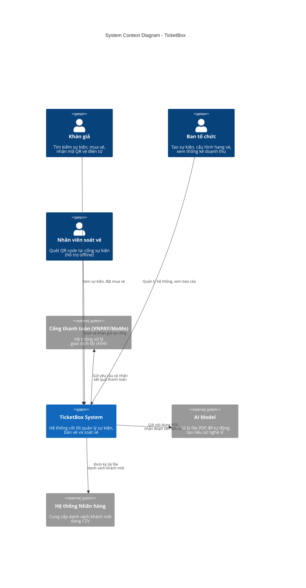
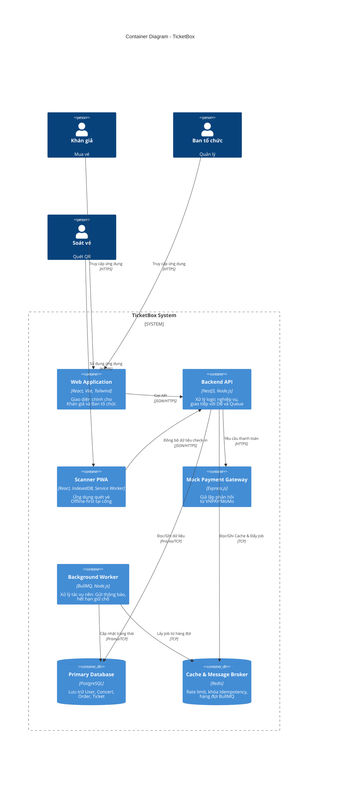
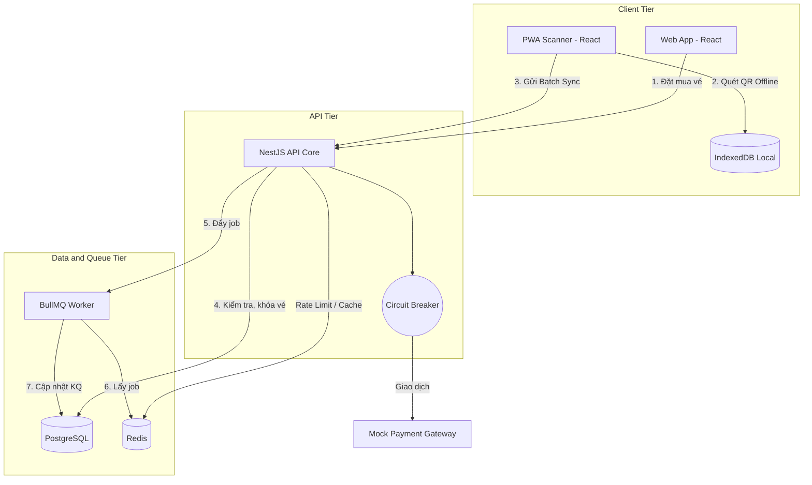

# TicketBox System Architecture Design

## 1. C4 Model - Level 1: System Context Diagram
Sơ đồ này thể hiện hệ thống TicketBox tương tác với các nhóm người dùng và các hệ thống bên ngoài.

### 1.1. C4 Model - Level 2: Container Diagram

### 1.2. Request Flow Diagram (Runtime View)

## Mechanisms (Person B)

### 2. Rate Limiting

- **Implementation**: Token Bucket pattern via Redis.
- **Why**: Protect against traffic spikes (e.g. 80k requests/5m).
- **ADR**: We chose Redis Token Bucket over memory caching to support horizontal scaling later, and to apply accurate rate limiting per IP/user identifier globally.

### 3. Circuit Breaker

- **Implementation**: Mock gateway wrapped by a Circuit Breaker middleware.
- **Why**: Handles payment gateway failure gracefully without blocking concert listing.
- **ADR**: Selected `opossum` for Node.js circuit breaker. We could have used native try-catch logic but `opossum` implements a robust Open/Half-Open/Closed state machine.

### 7. Caching

- **Implementation**: Cache-aside with Redis.
- **Why**: DB load reduction for highly concurrent read endpoints (e.g., concert list and detail).
- **ADR**: Selected Cache-aside over Read-through because of NestJS + Prisma constraints, and because we only need to cache hot data with a relatively short TTL. Explicit invalidation is done upon ticket purchase.

### 4. Idempotency (For Payment)

- **Implementation**: Idempotency-Key header cached in Redis.
- **Why**: Prevents double-charging if the user or app retries the same payment transaction.
- **ADR**: Redis TTL-based idempotency was preferred to a pure relational model check due to the speed and efficiency of checking Redis before hitting the payment logic or database.