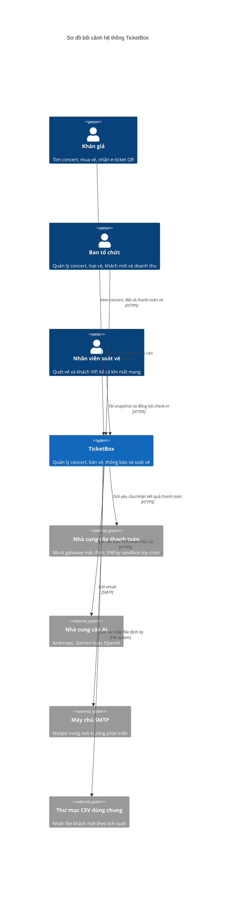
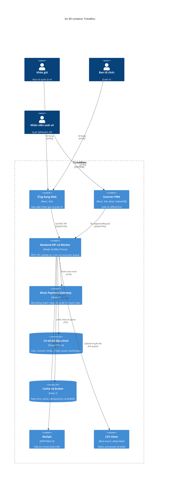
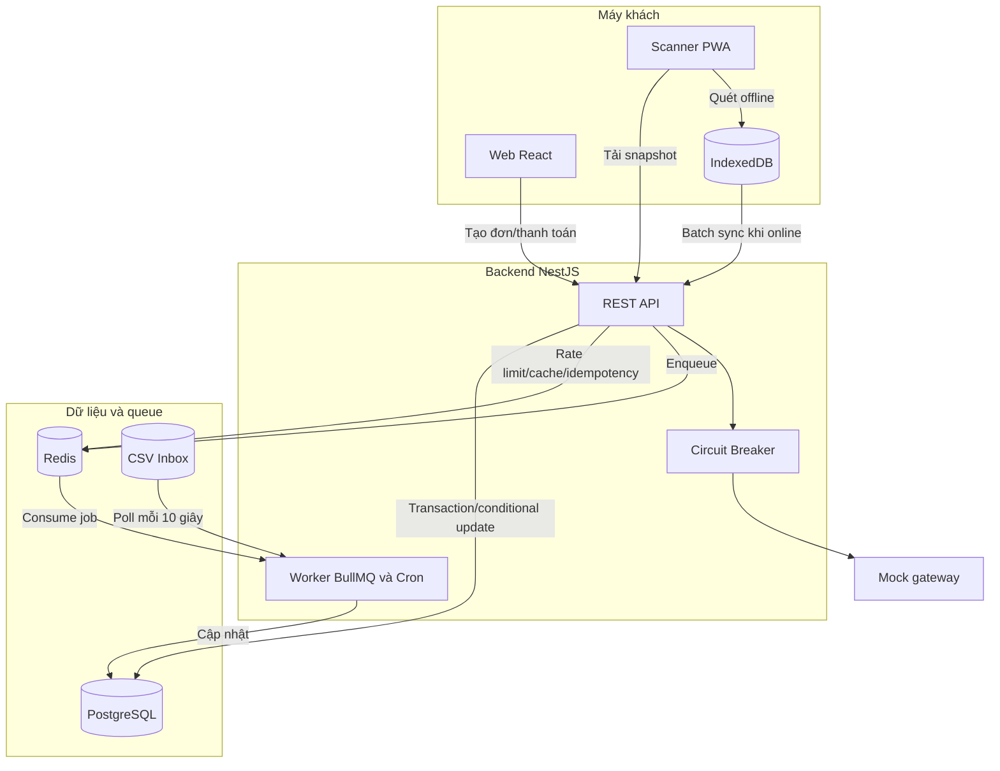
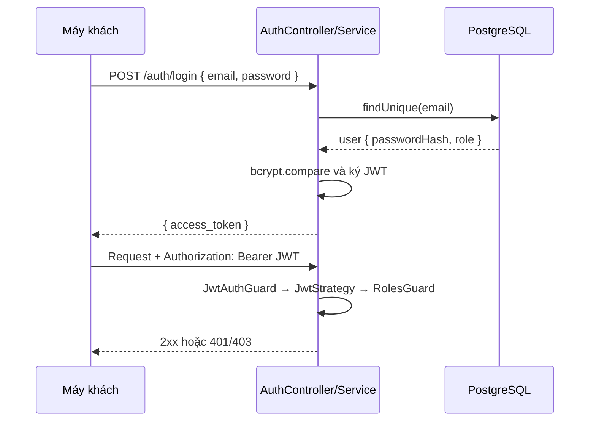

# Thiết kế kiến trúc hệ thống TicketBox

> Công nghệ: NestJS, Prisma, PostgreSQL, Redis/BullMQ; React + Vite cho web và Scanner PWA.

## 1. Mô hình C4 — Cấp 1: Bối cảnh hệ thống



### Kiến trúc tổng thể

TicketBox là **modular monolith** NestJS:

- **Tầng máy khách:** Web React cho khán giả/ban tổ chức và Scanner PWA cho nhân viên cổng.
- **Tầng API/nghiệp vụ:** Các module Auth, Concerts, Ticket Types, Orders, Payment, Notifications, Guests, AI Bio và Check-in giao tiếp qua lời gọi service hoặc `EventEmitter2`.
- **Tầng dữ liệu/nền:** PostgreSQL là nguồn dữ liệu chuẩn; Redis phục vụ token bucket, cache, idempotency và BullMQ.
- **Worker:** `OrdersProcessor`, `NotificationsProcessor` và `GuestsProcessor` chạy trong cùng tiến trình/container NestJS backend hiện tại. Chúng tách biệt logic qua queue nhưng chưa phải deployment riêng.
- **Giao tiếp:** Client dùng JSON/HTTP; worker dùng Redis queue; Prisma kết nối PostgreSQL; tích hợp ngoài dùng HTTP/SMTP.

## 1.1. Mô hình C4 — Cấp 2: Container



## 1.2. Luồng runtime chính



## 2. Thiết kế cơ sở dữ liệu

PostgreSQL là nguồn dữ liệu chuẩn. Prisma quản lý schema và migrations tại `src/backend/prisma/`. Khóa chính dùng UUID; một số ID như `CheckinLog.id` được tạo phía client để hỗ trợ đồng bộ idempotent.

### Sơ đồ quan hệ thực thể

```mermaid
erDiagram
  User ||--o{ Order : "đặt"
  User ||--o{ Notification : "nhận"
  User ||--o{ Ticket : "soát"
  Concert ||--o{ TicketType : "có"
  Concert ||--o{ Order : "bán qua"
  Concert ||--o{ GuestListEntry : "danh sách khách"
  Concert ||--o{ CsvImportBatch : "nhập"
  TicketType ||--o{ OrderItem : "được đặt"
  TicketType ||--o{ Ticket : "phát hành"
  Order ||--o{ OrderItem : "chứa"
  Order ||--o{ Ticket : "phát hành"
  Ticket ||--o{ CheckinLog : "lịch sử quét"

  User {
    string id PK
    string email UK
    string passwordHash
    Role role
    datetime createdAt
  }
  Concert {
    string id PK
    string slug UK
    string title
    string venue
    datetime startsAt
    ConcertStatus status
    string artistBio nullable
    string_array artists
    string bioSourceUrl nullable
    string seatMapSvg nullable
    datetime createdAt
  }
  TicketType {
    string id PK
    string concertId FK
    string name
    int price
    int totalQty
    int remainingQty
    int maxPerUser
    datetime saleStartsAt
  }
  Order {
    string id PK
    string userId FK
    string concertId FK
    OrderStatus status
    int totalAmount
    string idempotencyKey UK_nullable
    datetime expiresAt nullable
    datetime createdAt
  }
  OrderItem {
    string id PK
    string orderId FK
    string ticketTypeId FK
    int quantity
    int unitPrice
  }
  Ticket {
    string id PK
    string orderId FK
    string ticketTypeId FK
    string qrCode UK
    TicketStatus status
    datetime checkedInAt nullable
    string checkedInBy FK_nullable
  }
  CheckinLog {
    string id PK
    string ticketId FK
    string deviceId
    datetime scannedAt
    SyncStatus syncStatus
  }
  GuestListEntry {
    string id PK
    string concertId FK
    string fullName
    string docId nullable
    string zone
    string sourceBatchId
    GuestStatus status
  }
  CsvImportBatch {
    string id PK
    string concertId FK
    string filename
    string checksum
    ImportStatus status
    int rowsTotal
    int rowsOk
    int rowsFailed
    datetime createdAt
  }
  Notification {
    string id PK
    string userId FK
    string channel
    string type
    json payload
    NotificationStatus status
    datetime sentAt nullable
  }
```

### Quyết định thiết kế dữ liệu

- **Kho theo bộ đếm:** `TicketType.remainingQty` được giảm có điều kiện trong transaction; không tạo trước một dòng cho từng ghế.
- **Giữ chỗ thuộc đơn:** `Order.expiresAt` biểu diễn hạn giữ kho. Worker `orders` chạy mỗi phút để chuyển đơn hết hạn và hoàn kho.
- **QR toàn cục:** `Ticket.qrCode` unique để scanner tra vé từ payload.
- **Audit check-in:** `CheckinLog` append-only, `clientLogId` làm khóa chính. Guard chống quét trùng thực tế là conditional update `VALID → USED`.
- **CSV theo concert:** `CsvImportBatch` unique `(concertId, checksum)`, vì cùng nội dung có thể hợp lệ cho concert khác.
- **Khách thiếu giấy tờ:** unique `(concertId, docId, sourceBatchId)` không xử lý `NULL` theo mong muốn, nên service dedup `fullName` ở tầng ứng dụng.
- **Index:** Có index cho các khóa ngoại trên đường đọc nóng như `TicketType.concertId`, `Order(userId, concertId)`, `OrderItem.orderId/ticketTypeId`, `CheckinLog.ticketId`.
- **Xóa cascade:** Concert cascade sang loại vé, khách và batch; Order cascade sang item. `Ticket.checkedInBy` trong schema hiện chưa khai báo `onDelete: SetNull`, nên việc xóa user scanner có vé tham chiếu có thể bị DB chặn và cần xử lý rõ nếu bổ sung chức năng xóa user.

### Enum

`Role(AUDIENCE, ORGANIZER, SCANNER)`; `ConcertStatus(DRAFT, ON_SALE, CANCELLED)`; `OrderStatus(PENDING, PAID, FAILED, EXPIRED)`; `TicketStatus(VALID, USED, CANCELLED)`; `SyncStatus(PENDING, SYNCED, ACCEPTED, FAILED)`; `ImportStatus(PROCESSING, SUCCESS, FAILED)`; `NotificationStatus(PENDING, SENT, FAILED)`; `GuestStatus(INVITED, CHECKED_IN)`.

## 3. Xác thực và RBAC

JWT không trạng thái, mật khẩu bcrypt. Đăng ký công khai luôn tạo `AUDIENCE`; tài khoản `ORGANIZER` và `SCANNER` được cấp qua seed/quản trị.



Chi tiết xem [specs/auth.md](specs/auth.md).

## 4. Cô lập lỗi

| Thành phần lỗi | Tác động | Cơ chế xử lý |
|---|---|---|
| Mock/VNPay chậm hoặc lỗi | Không xác nhận thanh toán | Circuit Breaker trả nhanh `503`; đơn mock giữ `PENDING` khi circuit open; duyệt concert không phụ thuộc gateway |
| Redis lỗi | Rate limit, cache, idempotency và BullMQ bị ảnh hưởng | Các tính năng phụ thuộc Redis có thể lỗi; code hiện không có fallback đầy đủ sang PostgreSQL, cần giám sát/khởi động lại Redis |
| PostgreSQL lỗi | Nghiệp vụ lõi không đọc/ghi được | API trả lỗi; scanner đã tải snapshot vẫn quét cục bộ và chờ đồng bộ |
| Backend/worker dừng | API và consumer cùng dừng | Job còn bền vững trong Redis; tiếp tục khi backend khởi động lại |
| SMTP lỗi | Email trễ | Job email retry tối đa 3 lần với exponential backoff; in-app là job riêng |
| Nhà cung cấp AI lỗi | Không có nội dung AI đầy đủ | Lưu đoạn dự phòng từ PDF thay vì crash |
| Mất Internet tại cổng | Không gọi được backend | PWA dùng IndexedDB và đồng bộ lại; xung đột hai thiết bị phát hiện khi sync |

## 5. Bản ghi quyết định kiến trúc (ADR)

### ADR 1: Modular monolith thay vì microservices

- **Bối cảnh:** Nhóm nhỏ, thời gian phát triển ngắn và cần transaction nhất quán.
- **Quyết định:** Một ứng dụng NestJS chia module theo domain.
- **Hệ quả:** Dễ chạy, debug và giao dịch DB; không scale/deploy từng worker độc lập nếu chưa tách tiến trình.

### ADR 2: Khóa bi quan kết hợp conditional update

- **Bối cảnh:** Nhiều người tranh cùng loại vé có thể gây oversell và vượt giới hạn mỗi người.
- **Quyết định:** `SELECT ... FOR UPDATE` trên `TicketType`, đếm quota rồi giảm `remainingQty` có điều kiện trong cùng transaction.
- **Hệ quả:** Tính đúng đắn cao hơn nhưng transaction cùng loại vé bị tuần tự hóa.

### ADR 3: PostgreSQL thay vì NoSQL

- **Bối cảnh:** Order, item, ticket và kho cần ACID, khóa ngoại và aggregate.
- **Quyết định:** PostgreSQL là nguồn dữ liệu chuẩn, Prisma quản lý schema/migration.
- **Hệ quả:** Quan hệ nhất quán; migration và thay đổi schema phải được kiểm soát.

### ADR 4: BullMQ/Redis thay vì Kafka hoặc RabbitMQ

- **Bối cảnh:** Cần job cho hết hạn đơn, CSV và thông báo nhưng quy mô triển khai nhỏ.
- **Quyết định:** Tái sử dụng Redis với BullMQ trong backend.
- **Hệ quả:** Ít hạ tầng; Redis trở thành phụ thuộc chung và worker chưa cô lập deployment.

### ADR 5: CSV inbox polling dùng chung pipeline upload

- **Bối cảnh:** Cần nhập định kỳ lẫn thao tác tức thời từ admin.
- **Quyết định:** Cron quét bind mount mỗi 10 giây rồi gọi cùng `ingestBuffer`; checksum scoped theo concert.
- **Hệ quả:** Không lặp logic parse; mô hình một poller cần nâng cấp lock nếu chạy nhiều backend.

## 6. Các cơ chế kỹ thuật chính

### 6.1. Chống oversell và giới hạn mỗi người dùng

Khóa dòng loại vé, đếm đơn `PAID` và `PENDING` còn hạn, sau đó conditional decrement. Xem [specs/purchase.md](specs/purchase.md).

### 6.2. Rate limiting

Token bucket dùng Lua/Redis để chia sẻ trạng thái giữa instance. Khóa có thể theo IP hoặc user; login/register/payment/order có cấu hình chặt riêng. Redis lỗi hiện có thể làm request phụ thuộc guard thất bại, không phải limiter fail-open.

### 6.3. Circuit Breaker

`opossum` quản lý `CLOSED`, `OPEN`, `HALF-OPEN` quanh mock gateway. Trạng thái xem tại `GET /payment/status`; endpoint demo được guard bằng `ENABLE_DEMO_ENDPOINTS`.

### 6.4. Idempotency

- Tạo đơn: Redis `SET NX EX 86400` cộng unique `Order.idempotencyKey`.
- Xác nhận: kiểm tra trạng thái đơn và conditional transition `PENDING → PAID`.
- Check-in: UUID `clientLogId` cộng conditional transition `VALID → USED`.
- CSV: unique `(concertId, checksum)`.

### 6.5. Cache-aside

Danh sách concert cache 2 phút, chi tiết theo slug cache 1 phút. Tạo/cập nhật/xóa/hủy concert và thao tác giữ kho vô hiệu hóa cache liên quan. Thay đổi trực tiếp `TicketType` hiện chưa invalidation nên public detail có thể cũ tối đa 60 giây; stats admin vẫn đọc thẳng DB.

### 6.6. Đồng bộ ngoại tuyến

Scanner dùng Dexie/IndexedDB cho snapshot và hai queue: vé thường, khách VIP. Sync chạy mỗi 10 giây và khi online; conflict khác thiết bị được phản hồi về UI. Xem [specs/checkin.md](specs/checkin.md).

### 6.7. Tác vụ nền và thông báo

Queue `orders`, `guests`, `notifications` cùng cron nhắc 24 giờ chạy trong backend. Email dùng Nodemailer, QR được sinh PNG và đính kèm. Xem [specs/notifications.md](specs/notifications.md) và [specs/csv-ingestion.md](specs/csv-ingestion.md).
