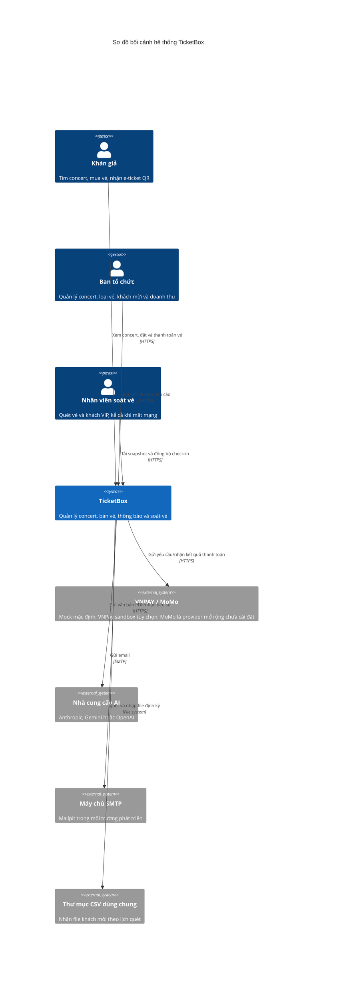
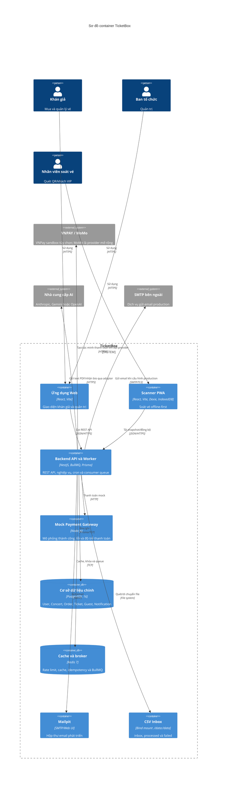
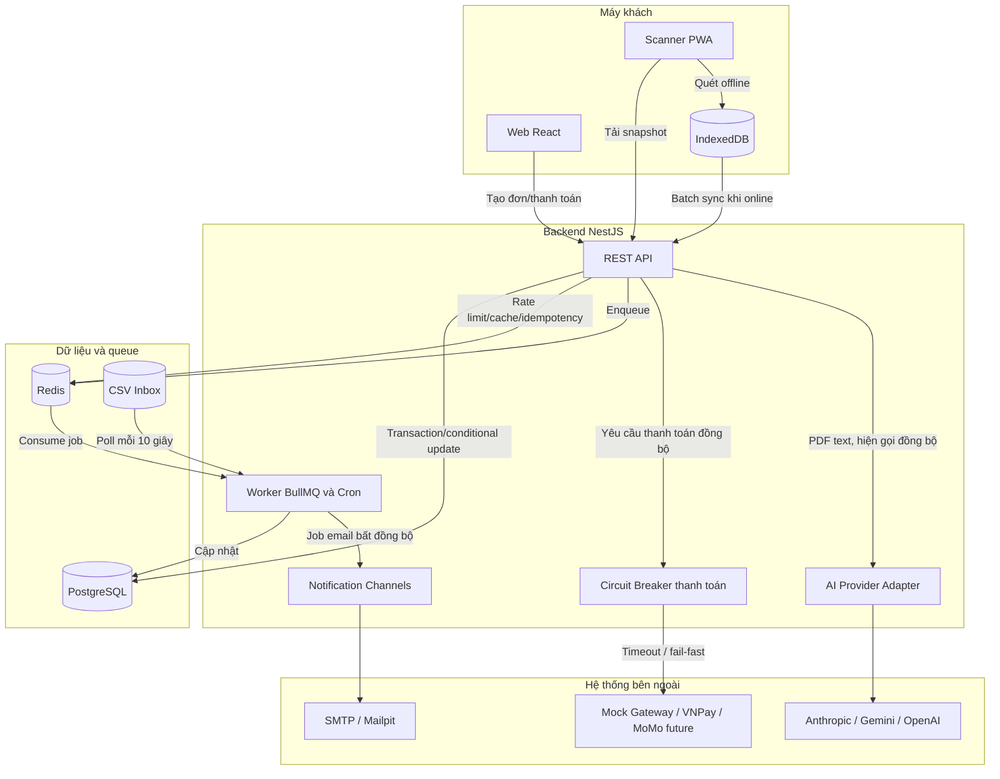
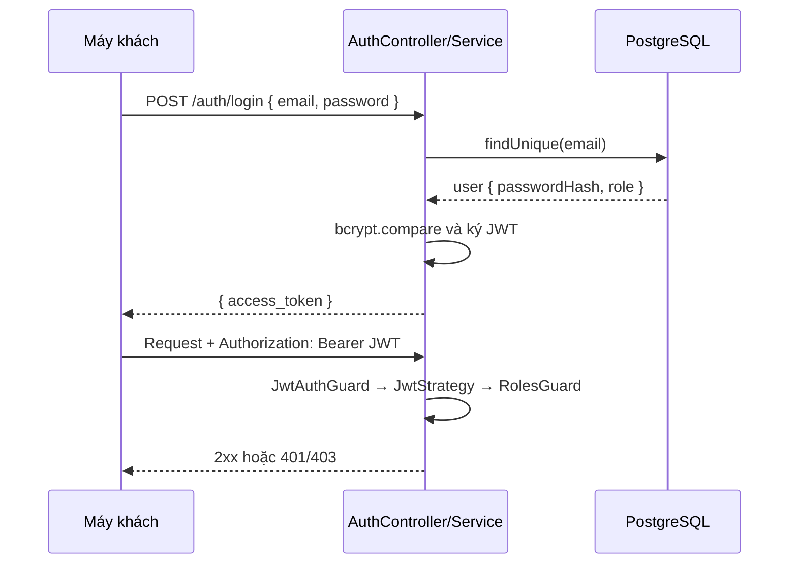

# Thiết kế kiến trúc hệ thống TicketBox

> Công nghệ: NestJS, Prisma, PostgreSQL, Redis/BullMQ; React + Vite cho web và Scanner PWA.

## 0. Mục tiêu và phương pháp ra quyết định kiến trúc

Kiến trúc không được chọn chỉ vì một công nghệ quen thuộc hoặc đang phổ biến. Mỗi quyết định trong tài liệu này được đánh giá theo các lực tác động cụ thể của TicketBox:

1. **Tính đúng đắn trước tiên:** không bán vượt kho, không vượt quota người mua và không phát hành vé hai lần quan trọng hơn việc trả lời mọi request thật nhanh.
2. **Tải có tính bùng nổ:** 80.000 lượt truy cập trong 5 phút, 70% ở phút đầu, tương đương trung bình khoảng `80.000 × 70% / 60 ≈ 933` người dùng/giây trước khi tính refresh, retry và bot.
3. **Đọc nhiều, ghi tranh chấp cao:** trang concert có thể cache, nhưng thao tác giữ vé cùng một `TicketType` là điểm tranh chấp nóng và phải đi qua nguồn dữ liệu nhất quán.
4. **Phụ thuộc ngoài không đáng tin cậy:** payment, SMTP và AI có thể chậm hoặc lỗi mà không được kéo sập chức năng duyệt concert.
5. **Mạng tại cổng không ổn định:** scanner phải tiếp tục ghi nhận cục bộ, đồng thời phải công khai giới hạn không thể tránh của hai thiết bị hoàn toàn mất liên lạc.
6. **Nguồn lực dự án hữu hạn:** nhóm nhỏ, thời gian môn học ngắn, hệ thống phải clone, chạy và demo được trên một máy bằng Docker Compose.
7. **Khả năng tiến hóa:** ranh giới domain, interface và queue phải cho phép tách thành deployment độc lập khi tải hoặc quy mô nhóm thực sự yêu cầu.

### 0.1. Thuộc tính chất lượng và thứ tự ưu tiên

| Ưu tiên | Thuộc tính | Biểu hiện trong thiết kế | Điều chấp nhận đánh đổi |
|---|---|---|---|
| 1 | Consistency/correctness | PostgreSQL transaction, row lock, conditional state transition, unique key | Một số giao dịch vé hot bị tuần tự hóa |
| 2 | Availability có kiểm soát | Cache cho public read, Circuit Breaker, queue, scanner offline | Payment/AI/email có thể suy giảm hoặc trả chậm |
| 3 | Chịu tải | Redis token bucket, cache-aside, stateless API | Rate limit có thể từ chối request bằng `429` thay vì nhận quá khả năng |
| 4 | Khả năng phục hồi | Idempotency nhiều lớp, retry có backoff, append-only audit | Phải chấp nhận xử lý at-least-once và viết consumer idempotent |
| 5 | Modifiability | Module theo domain, Strategy cho notification/AI/payment | Chưa có isolation/deploy độc lập như microservices |
| 6 | Operability | Một Docker Compose, ít loại hạ tầng | Redis hiện là shared failure domain |

### 0.2. Phạm vi bảo đảm

- **Đã cài đặt:** mô tả đúng hành vi code hiện tại và có thể kiểm thử trong repository.
- **Bảo đảm ở nguồn dữ liệu chuẩn:** PostgreSQL không ghi nhận oversell, phát hành vé trùng hoặc hai check-in chính thức cho cùng vé.
- **Không tuyên bố quá mức:** rate limiting hiện tại bảo vệ từng identity/endpoint nhưng chưa phải virtual waiting room chống bot hoàn chỉnh; hai scanner hoàn toàn offline vẫn có thể cùng tạm chấp nhận một QR trước khi server phát hiện xung đột.
- **Định hướng production:** các cải tiến như admission queue, gate partition, Redis HA và tách worker là điều kiện tiến hóa, chưa được mô tả như chức năng đã hoàn thành.

### 0.3. Lựa chọn phong cách kiến trúc

| Phương án | Ưu điểm | Nhược điểm trong TicketBox | Kết luận |
|---|---|---|---|
| Layered monolith không chia domain rõ | Ít khái niệm, khởi tạo nhanh | Dễ để Order, Payment, Notification phụ thuộc chéo; khó tách về sau | Không chọn |
| **Modular monolith** | Transaction cục bộ; một deployment; module và interface vẫn rõ; test end-to-end đơn giản | Scale/deploy thô; lỗi tiến trình có blast radius lớn hơn | **Chọn cho phạm vi hiện tại** |
| Microservices | Scale và deploy từng domain; cô lập tiến trình tốt | Cần saga/outbox, tracing, service discovery; transaction kho–đơn–quota trở thành bài toán phân tán | Chưa chọn ở giai đoạn môn học |
| Serverless theo chức năng | Co giãn theo request, ít quản trị server | Cold start, connection DB, job dài và transaction nóng khó dự đoán; local demo phức tạp | Không chọn |

Lưu lượng lớn không tự động buộc hệ thống dùng microservices. Điểm nghẽn khó nhất là nhiều request tranh cùng một dòng kho; tách Inventory và Order thành hai service không xóa điểm nghẽn mà còn làm mất transaction cục bộ. TicketBox vì vậy chọn **monolith-first nhưng có ranh giới module**, ưu tiên khả năng chứng minh correctness và khả năng bàn giao. Khi worker nền ảnh hưởng latency API, các domain có đội sở hữu riêng, hoặc cần scale Payment/Notification độc lập, các module và BullMQ event là seam để tách deployment.

## 1. Mô hình C4 — Cấp 1: Bối cảnh hệ thống



### Kiến trúc tổng thể

TicketBox là **modular monolith** NestJS:

- **Tầng máy khách:** Web React cho khán giả/ban tổ chức và Scanner PWA cho nhân viên cổng.
- **Tầng API/nghiệp vụ:** Các module Auth, Concerts, Ticket Types, Orders, Payment, Notifications, Guests, AI Bio và Check-in giao tiếp qua lời gọi service hoặc `EventEmitter2`.
- **Tầng dữ liệu/nền:** PostgreSQL là nguồn dữ liệu chuẩn; Redis phục vụ token bucket, cache, idempotency và BullMQ.
- **Worker:** `OrdersProcessor`, `NotificationsProcessor` và `GuestsProcessor` chạy trong cùng tiến trình/container NestJS backend hiện tại. Chúng tách biệt logic qua queue nhưng chưa phải deployment riêng.
- **Giao tiếp:** Client dùng JSON/HTTP; worker dùng Redis queue; Prisma kết nối PostgreSQL; tích hợp ngoài dùng HTTP/SMTP.

## 1.1. Mô hình C4 — Cấp 2: Container



## 1.2. Luồng runtime chính



**Ranh giới lỗi:** public read không gọi Payment, AI hay SMTP. Payment và AI đi qua adapter riêng; payment có Circuit Breaker, AI có nội dung fallback. SMTP chỉ được gọi từ job nên không nằm trên critical path thanh toán. CSV parse và notification chạy qua BullMQ nhưng worker hiện cùng tiến trình backend: logic đã bất đồng bộ, còn cô lập tiến trình/deployment chưa đạt được.

## 2. Thiết kế cơ sở dữ liệu

PostgreSQL là nguồn dữ liệu chuẩn. Prisma quản lý schema và migrations tại `src/backend/prisma/`. Khóa chính dùng UUID; một số ID như `CheckinLog.id` được tạo phía client để hỗ trợ đồng bộ idempotent.

### Sơ đồ quan hệ thực thể

```mermaid
erDiagram
  User ||--o{ Order : "đặt"
  User ||--o{ Notification : "nhận"
  User ||--o{ Ticket : "soát"
  Concert ||--o{ TicketType : "có"
  Concert ||--o{ Order : "bán qua"
  Concert ||--o{ GuestListEntry : "danh sách khách"
  Concert ||--o{ CsvImportBatch : "nhập"
  TicketType ||--o{ OrderItem : "được đặt"
  TicketType ||--o{ Ticket : "phát hành"
  Order ||--o{ OrderItem : "chứa"
  Order ||--o{ Ticket : "phát hành"
  Ticket ||--o{ CheckinLog : "lịch sử quét"

  User {
    string id PK
    string email UK
    string passwordHash
    Role role
    datetime createdAt
  }
  Concert {
    string id PK
    string slug UK
    string title
    string venue
    datetime startsAt
    ConcertStatus status
    string artistBio nullable
    string_array artists
    string bioSourceUrl nullable
    string seatMapSvg nullable
    datetime createdAt
  }
  TicketType {
    string id PK
    string concertId FK
    string name
    int price
    int totalQty
    int remainingQty
    int maxPerUser
    datetime saleStartsAt
  }
  Order {
    string id PK
    string userId FK
    string concertId FK
    OrderStatus status
    int totalAmount
    string idempotencyKey UK_nullable
    datetime expiresAt nullable
    datetime createdAt
  }
  OrderItem {
    string id PK
    string orderId FK
    string ticketTypeId FK
    int quantity
    int unitPrice
  }
  Ticket {
    string id PK
    string orderId FK
    string ticketTypeId FK
    string qrCode UK
    TicketStatus status
    datetime checkedInAt nullable
    string checkedInBy FK_nullable
  }
  CheckinLog {
    string id PK
    string ticketId FK
    string deviceId
    datetime scannedAt
    SyncStatus syncStatus
  }
  GuestListEntry {
    string id PK
    string concertId FK
    string fullName
    string docId nullable
    string zone
    string sourceBatchId
    GuestStatus status
  }
  CsvImportBatch {
    string id PK
    string concertId FK
    string filename
    string checksum
    ImportStatus status
    int rowsTotal
    int rowsOk
    int rowsFailed
    datetime createdAt
  }
  Notification {
    string id PK
    string userId FK
    string channel
    string type
    json payload
    NotificationStatus status
    datetime sentAt nullable
  }
```

### Quyết định thiết kế dữ liệu

#### Vì sao PostgreSQL là nguồn dữ liệu chuẩn

| Phương án | Điểm mạnh | Rủi ro/chi phí | Đánh giá |
|---|---|---|---|
| **PostgreSQL** | ACID; foreign key; unique constraint; row lock; aggregate doanh thu thuận tiện | Schema/migration phải kiểm soát; write contention tại vé hot | Chọn làm system of record |
| Document database | Linh hoạt cho metadata concert và bio | Quan hệ Order–Item–Ticket, quota và tồn kho khó bảo đảm khi phân tán document | Không đủ lợi ích để thêm một DB |
| Redis làm kho chính | Atomic counter nhanh | Durability, phục hồi reservation và reconciliation tài chính phức tạp | Chỉ dùng tăng tốc/điều phối, không làm nguồn sự thật |
| Kết hợp SQL + document DB | Tối ưu riêng từng loại dữ liệu | Dual-write, consistency và vận hành thêm một datastore | Chưa cần; PostgreSQL array/JSON đã đủ phạm vi |

Order, inventory, quota và ticket thay đổi cùng nhau và cần invariant mạnh, nên SQL phù hợp hơn mô hình eventual consistency. Metadata linh hoạt như `artists` và `Notification.payload` vẫn có thể biểu diễn bằng array/JSON trong PostgreSQL. Quyết định này giảm số failure mode và giữ toàn bộ thao tác cấp vé trong một transaction có thể kiểm chứng.

#### Consistency model theo loại dữ liệu

| Dữ liệu | Mức nhất quán | Cơ chế | Lý do |
|---|---|---|---|
| Kho, quota, order, ticket | Strong consistency | PostgreSQL transaction + conditional update | Sai lệch gây oversell hoặc mất tiền |
| Trạng thái check-in chính thức | Strong tại server | `VALID → USED` có điều kiện | Chỉ một lần sync được chấp nhận |
| Danh sách/chi tiết concert công khai | Eventual trong TTL | Cache-aside + invalidation | Cho phép cũ ngắn hạn để giảm read load |
| Email/in-app notification | Eventual | BullMQ retry | Không được chặn transaction thanh toán |
| AI bio | Eventual về nghiệp vụ | Provider adapter + fallback | Không phải dữ liệu tài chính cốt lõi |
| Scanner offline | Local-first rồi reconcile | IndexedDB + batch sync | Mạng cổng không đáng tin cậy |

- **Kho theo bộ đếm:** `TicketType.remainingQty` được giảm có điều kiện trong transaction; không tạo trước một dòng cho từng ghế.
- **Giữ chỗ thuộc đơn:** `Order.expiresAt` biểu diễn hạn giữ kho. Worker `orders` chạy mỗi phút để chuyển đơn hết hạn và hoàn kho.
- **QR toàn cục:** `Ticket.qrCode` unique để scanner tra vé từ payload.
- **Audit check-in:** `CheckinLog` append-only, `clientLogId` làm khóa chính. Guard chống quét trùng thực tế là conditional update `VALID → USED`.
- **CSV theo concert:** `CsvImportBatch` unique `(concertId, checksum)`, vì cùng nội dung có thể hợp lệ cho concert khác.
- **Khách thiếu giấy tờ:** unique `(concertId, docId, sourceBatchId)` không xử lý `NULL` theo mong muốn, nên service dedup `fullName` ở tầng ứng dụng.
- **Index:** Có index cho các khóa ngoại trên đường đọc nóng như `TicketType.concertId`, `Order(userId, concertId)`, `OrderItem.orderId/ticketTypeId`, `CheckinLog.ticketId`.
- **Xóa cascade:** Concert cascade sang loại vé, khách và batch; Order cascade sang item. `Ticket.checkedInBy` trong schema hiện chưa khai báo `onDelete: SetNull`, nên việc xóa user scanner có vé tham chiếu có thể bị DB chặn và cần xử lý rõ nếu bổ sung chức năng xóa user.

### Enum

`Role(AUDIENCE, ORGANIZER, SCANNER)`; `ConcertStatus(DRAFT, ON_SALE, CANCELLED)`; `OrderStatus(PENDING, PAID, FAILED, EXPIRED)`; `TicketStatus(VALID, USED, CANCELLED)`; `SyncStatus(PENDING, SYNCED, ACCEPTED, FAILED)`; `ImportStatus(PROCESSING, SUCCESS, FAILED)`; `NotificationStatus(PENDING, SENT, FAILED)`; `GuestStatus(INVITED, CHECKED_IN)`.

## 3. Xác thực và RBAC

JWT không trạng thái, mật khẩu bcrypt. Đăng ký công khai luôn tạo `AUDIENCE`; tài khoản `ORGANIZER` và `SCANNER` được cấp qua seed/quản trị.



Chi tiết xem [specs/auth.md](specs/auth.md).

## 4. Cô lập lỗi

| Thành phần lỗi | Tác động | Cơ chế xử lý |
|---|---|---|
| Mock/VNPay chậm hoặc lỗi | Không xác nhận thanh toán | Circuit Breaker trả nhanh `503`; đơn mock giữ `PENDING` khi circuit open; duyệt concert không phụ thuộc gateway |
| Redis lỗi | Rate limit, cache, idempotency và BullMQ bị ảnh hưởng | Các tính năng phụ thuộc Redis có thể lỗi; code hiện không có fallback đầy đủ sang PostgreSQL, cần giám sát/khởi động lại Redis |
| PostgreSQL lỗi | Nghiệp vụ lõi không đọc/ghi được | API trả lỗi; scanner đã tải snapshot vẫn quét cục bộ và chờ đồng bộ |
| Backend/worker dừng | API và consumer cùng dừng | Job còn bền vững trong Redis; tiếp tục khi backend khởi động lại |
| SMTP lỗi | Email trễ | Job email retry tối đa 3 lần với exponential backoff; in-app là job riêng |
| Nhà cung cấp AI lỗi | Không có nội dung AI đầy đủ | Lưu đoạn dự phòng từ PDF thay vì crash |
| Mất Internet tại cổng | Không gọi được backend | PWA dùng IndexedDB và đồng bộ lại; xung đột hai thiết bị phát hiện khi sync |

## 5. Bản ghi quyết định kiến trúc (ADR)

### ADR 1: Modular monolith thay vì microservices

- **Bối cảnh:** Nhóm nhỏ, thời gian phát triển ngắn, cần clone/demo cục bộ và cần transaction nhất quán giữa kho, quota, order và ticket.
- **Phương án cân nhắc:** layered monolith, modular monolith và microservices. Microservices cô lập/scaling tốt hơn nhưng buộc luồng mua vé dùng saga/outbox và xử lý partial failure giữa Inventory–Order–Payment. Layered monolith đơn giản nhưng không tạo ranh giới domain đủ rõ.
- **Quyết định:** Một ứng dụng NestJS chia module theo domain; giao tiếp đồng bộ bằng service cho invariant cùng transaction, giao tiếp hậu xử lý bằng event/queue.
- **Vì sao phù hợp:** Điểm tranh chấp chính là một dòng `TicketType`; thêm network hop không tăng correctness hay throughput tại đây. Một DB transaction dễ kiểm thử hơn distributed transaction, trong khi stateless API vẫn có thể nhân bản ngang ở phần lớn endpoint.
- **Đánh đổi chấp nhận:** Backend và worker hiện chung tiến trình, nên crash hoặc CPU-heavy task có blast radius lớn; không scale riêng notification/CSV.
- **Giảm thiểu:** Domain module không truy cập dữ liệu tùy tiện qua nhau; payment, notification và AI có adapter; BullMQ tạo seam cho worker độc lập.
- **Xem xét lại khi:** cần deploy/scale từng domain, worker ảnh hưởng p95 API, có nhiều đội sở hữu độc lập, hoặc một release monolith không đáp ứng SLA.

### ADR 2: Khóa bi quan kết hợp conditional update

- **Bối cảnh:** Nhiều người tranh cùng loại vé có thể gây oversell; một người cũng có thể gửi nhiều request song song để vượt quota.
- **Phương án cân nhắc:**
  - Optimistic versioning tránh giữ lock nhưng ở giờ mở bán có conflict cao, retry làm tăng tải DB.
  - Chỉ atomic decrement ngăn kho âm nhưng không làm phép đếm quota và giữ kho thành một thao tác nguyên tử.
  - Redis reservation có throughput cao nhưng sinh dual-write và bài toán phục hồi/reconciliation.
  - Queue tuần tự hóa admission tạo fairness tốt hơn nhưng tăng latency và cần waiting-room protocol.
- **Quyết định:** khóa dòng `TicketType`, trong cùng transaction đếm `PAID` + `PENDING` còn hạn của user, sau đó conditional decrement và tạo order.
- **Vì sao phù hợp:** Ưu tiên chứng minh invariant `remainingQty >= 0` và `userQty <= maxPerUser`; PostgreSQL là nguồn sự thật nên không có cửa sổ lệch Redis–DB.
- **Đánh đổi chấp nhận:** mọi transaction cùng loại vé bị serialize; vé SVIP hot có thể tạo lock queue. Đây là lựa chọn correctness trước throughput, không phải tuyên bố đã xử lý vô hạn request/giây.
- **Giảm thiểu:** transaction ngắn, không gọi payment/SMTP/AI khi đang giữ lock; rate limit trước DB; order giữ chỗ có TTL và hoàn kho idempotent.
- **Xem xét lại khi:** load test cho thấy lock wait vượt SLO. Bước tiến hóa là admission/waiting-room queue theo `TicketType`, không chuyển thẳng sang eventual consistency.

### ADR 3: PostgreSQL thay vì NoSQL

- **Bối cảnh:** Order, item, ticket và kho có quan hệ chặt, cần ACID, unique constraint, foreign key và báo cáo doanh thu.
- **Phương án cân nhắc:** document DB linh hoạt nhưng đẩy invariant liên document lên ứng dụng; Redis-only nhanh nhưng không phù hợp làm ledger bền vững; polyglot persistence tăng dual-write và chi phí vận hành.
- **Quyết định:** PostgreSQL là system of record, Prisma quản lý schema/migration; Redis chỉ là cache, coordination và queue.
- **Vì sao phù hợp:** toàn bộ invariant tài chính được commit/rollback cùng nhau; metadata linh hoạt hiện vẫn biểu diễn được bằng array/JSON.
- **Đánh đổi chấp nhận:** schema evolution phải qua migration; hot-row contention không được database tự giải quyết.
- **Xem xét lại khi:** xuất hiện workload tài liệu/analytics độc lập có quy mô đủ lớn để biện minh datastore riêng; dữ liệu tài chính vẫn phải có nguồn chuẩn và cơ chế đồng bộ rõ.

### ADR 4: BullMQ/Redis thay vì Kafka hoặc RabbitMQ

- **Bối cảnh:** Cần delayed/repeatable job, retry/backoff cho hết hạn đơn, CSV và thông báo; chưa có nhu cầu event streaming dài hạn.
- **Phương án cân nhắc:** RabbitMQ mạnh về routing nhưng cần broker riêng và cấu hình delayed job; Kafka mạnh về replay/stream throughput nhưng quá nặng cho job queue; DB polling giảm một công nghệ nhưng tăng tải DB và phải tự xây retry/locking.
- **Quyết định:** BullMQ trên Redis, với queue theo nhóm nghiệp vụ và consumer hiện chạy trong backend.
- **Vì sao phù hợp:** delayed job, retry và repeatable schedule là primitive trực tiếp; tái sử dụng Redis giúp Docker Compose và demo đơn giản.
- **Đánh đổi chấp nhận:** BullMQ có semantics at-least-once, không phải exactly-once; Redis trở thành shared dependency; logic async chưa đồng nghĩa process isolation.
- **Giảm thiểu:** processor phải idempotent bằng state transition/unique key; retry có giới hạn và backoff; lỗi một channel notification không rollback order.
- **Xem xét lại khi:** cần replay event dài hạn/audit stream (Kafka), routing liên service phức tạp (RabbitMQ), hoặc cần worker deployment/Redis cluster riêng.

### ADR 5: CSV inbox polling dùng chung pipeline upload

- **Bối cảnh:** Hệ thống đối tác không có API; file đến theo lịch nhưng admin vẫn cần upload tức thời.
- **Phương án cân nhắc:** filesystem watcher phản hồi nhanh nhưng dễ nhận file đang copy dở và hành vi khác nhau theo OS; hai pipeline riêng gây lặp validation/dedup; object-storage event tốt cho production nhưng vượt phạm vi local demo.
- **Quyết định:** cron quét bind mount mỗi 10 giây, bỏ qua file vừa thay đổi, rồi gọi cùng `ingestBuffer` với upload; SHA-256 scoped theo concert.
- **Vì sao phù hợp:** polling đơn giản, có thể quan sát và khởi động lại; mọi nguồn file dùng chung validation, batch, queue và idempotency.
- **Đánh đổi chấp nhận:** độ trễ tối đa một chu kỳ; poller hiện chỉ an toàn một instance; buffer toàn file trước khi stream parse.
- **Xem xét lại khi:** chạy nhiều backend, file lớn hoặc inbox nằm trên object storage; khi đó cần leader/distributed lock, upload size limit và event của storage.

### ADR 6: Redis dùng chung cho cache, rate limit, idempotency và queue

- **Bối cảnh:** Bốn nhu cầu đều cần shared state nhanh, TTL hoặc queue; project cần ít hạ tầng để chạy được trên máy chấm.
- **Phương án cân nhắc:** tách Redis theo workload giảm blast radius nhưng tăng container/cấu hình; dùng PostgreSQL cho tất cả giảm công nghệ nhưng đưa traffic cache/rate limit vào DB lõi.
- **Quyết định:** một Redis deployment trong phạm vi hiện tại, phân tách bằng key prefix/queue name; PostgreSQL vẫn giữ unique key và trạng thái nghiệp vụ bền vững.
- **Vì sao phù hợp:** giảm chi phí vận hành, Lua token bucket atomic giữa các API instance và BullMQ dùng ngay cùng hạ tầng.
- **Đánh đổi chấp nhận:** Redis là shared failure domain. Redis lỗi làm cache miss path, limiter, fast idempotency và worker cùng bị ảnh hưởng; code hiện không có fallback hoàn chỉnh.
- **Chính sách lỗi:** thao tác tạo order nên fail-closed khi không bảo đảm idempotency/rate control; notification có thể trì hoãn; public read chỉ nên fallback DB nếu có bulkhead/limit để không tạo cache stampede.
- **Xem xét lại khi:** production yêu cầu HA. Khi đó tách cache khỏi queue/idempotency, bật persistence/replication phù hợp và giám sát memory/eviction riêng.

### ADR 7: Token bucket phân tán thay vì fixed/sliding window

- **Bối cảnh:** phút đầu trung bình khoảng 933 người dùng/giây, cộng bot/retry; cần cho burst ngắn hợp lệ nhưng chặn một identity gửi liên tục.
- **Phương án cân nhắc:** fixed window đơn giản nhưng có boundary burst gấp đôi; sliding log chính xác nhưng tốn bộ nhớ; leaky bucket làm phẳng tuyệt đối nhưng kém linh hoạt với burst; token bucket cân bằng burst và sustained rate.
- **Quyết định:** Lua/Redis token bucket dùng timestamp phía Redis, áp dụng global guard và override theo endpoint/identity.
- **Cấu hình hiện tại:** mặc định 100 burst, refill 10 request/giây; register 10/1 theo IP; login 5/0,5 theo IP; payment 20/2; tạo order 150/10 theo user. Response có remaining/reset headers và `429` khi hết token.
- **Đánh đổi và giới hạn:** các ngưỡng hiện phục vụ demo/load test, chưa được chứng minh là capacity production; IP có thể chặn oan NAT, user-only không chặn bot trước login. Rate limit bảo vệ backend nhưng **không tự bảo đảm fairness**.
- **Nâng cấp production:** đo capacity rồi đặt admission budget; kết hợp IP + account + endpoint; client tôn trọng `Retry-After` hiện có; CAPTCHA/risk signal; một purchase attempt đang hoạt động/account; virtual waiting room hoặc FIFO admission token cho sale hot.
- **Xem xét lại khi:** load test p95/error rate hoặc tỷ lệ false-positive cho thấy ngưỡng không phù hợp. Ngưỡng phải là config dựa trên số đo, không là hằng số kiến trúc bất biến.

### ADR 8: Cache-aside Redis với invalidation chủ động

- **Bối cảnh:** public pages đọc hàng nghìn lần/giây nhưng metadata ít đổi; số vé còn lại thay đổi nhanh và chỉ DB transaction mới quyết định có mua được hay không.
- **Phương án cân nhắc:** no-cache quá tải DB; write-through tăng coupling mọi đường ghi; CDN tốt cho asset/metadata nhưng inventory cá nhân hóa và invalidation khó; cache-aside đơn giản và cho phép DB là nguồn chuẩn.
- **Quyết định:** cache list 120 giây và detail 60 giây; service concert/order chủ động invalidate. Stats admin đọc DB.
- **Semantics:** dữ liệu public là gần thời gian thực; giá trị `remainingQty` hiển thị không phải reservation. `POST /orders` luôn kiểm tra lại trong transaction.
- **Đánh đổi chấp nhận:** direct update `TicketType` hiện chưa invalidate nên detail có thể cũ 60 giây; concurrent cache miss có nguy cơ stampede.
- **Nâng cấp:** tách metadata TTL dài khỏi inventory TTL 1–3 giây hoặc counter/read model riêng; invalidate trên mọi reserve/release/update; request coalescing và TTL jitter; CDN cho asset/seat map.

### ADR 9: JWT stateless + RBAC thay vì server session

- **Bối cảnh:** Web, PWA và API cần cùng cơ chế xác thực; backend có thể nhân bản mà không cần sticky session; quyền chỉ có ba role ổn định.
- **Phương án cân nhắc:** server session thu hồi dễ nhưng cần shared session store; opaque token linh hoạt nhưng mọi request phải introspect; JWT tự chứa role và kiểm tra cục bộ.
- **Quyết định:** access JWT `{sub,email,role}` và RBAC guard; public registration luôn là `AUDIENCE`.
- **Vì sao phù hợp:** đơn giản cho REST/PWA, không thêm session state và enforcement tập trung tại API thay vì tin UI.
- **Đánh đổi chấp nhận:** hiện chưa có refresh token/revocation; role trong token có thể cũ đến khi hết hạn; bảo vệ token/XSS là trách nhiệm quan trọng.
- **Nâng cấp production:** access token ngắn hạn, refresh rotation/revocation cho organizer/scanner, secure storage/cookie policy và audit thay đổi quyền.

### ADR 10: Scanner PWA offline-first thay vì native-only

- **Bối cảnh:** cần camera, local storage và chạy offline nhưng phải bàn giao/demo nhanh trên nhiều thiết bị.
- **Phương án cân nhắc:** native app cho camera/background/MDM tốt hơn nhưng cần hai nền tảng và phân phối app; web online-only không đáp ứng mất mạng; PWA dùng chung React và IndexedDB.
- **Quyết định:** React PWA + Dexie/IndexedDB, tải snapshot và giữ queue qua lần đăng nhập/khởi động lại.
- **Vì sao phù hợp:** không cần app store, một codebase, đủ API cho camera và lưu cục bộ trong môi trường demo có thiết bị/trình duyệt kiểm soát.
- **Đánh đổi chấp nhận:** background sync/storage/camera khác nhau giữa trình duyệt; hai thiết bị bị partition không thể biết trạng thái của nhau.
- **Xem xét lại khi:** cần MDM/kiosk, scanner phần cứng chuyên dụng, secure storage hoặc background execution được bảo đảm; khi đó native/edge gateway phù hợp hơn.

### ADR 11: Circuit Breaker quanh payment thay vì retry vô hạn

- **Bối cảnh:** gateway chậm giữ connection/event-loop resource; retry đồng loạt có thể tạo retry storm và làm lỗi lan sang toàn API.
- **Phương án cân nhắc:** chỉ timeout ngắt từng request nhưng vẫn tiếp tục gửi request mới tới dependency đang hỏng; retry vô hạn tăng tải và nguy cơ giao dịch lặp; queue toàn bộ payment thay đổi UX redirect/return của gateway.
- **Quyết định:** `opossum` bọc payment adapter với mặc định timeout 5 giây, error threshold 50%, volume threshold 5, reset 10 giây; trạng thái `OPEN` fail-fast `503`, sau đó `HALF_OPEN` thăm dò.
- **Vì sao phù hợp:** cô lập dependency ngoài khỏi public read, giải phóng tài nguyên nhanh và cho gateway thời gian phục hồi. Order vẫn `PENDING` để người dùng retry trong thời gian giữ chỗ.
- **Đánh đổi chấp nhận:** threshold thấp phù hợp demo nhưng có thể mở circuit do mẫu nhỏ; một circuit chung có thể gom failure của nhiều merchant nếu sau này thêm nhiều gateway.
- **Nâng cấp production:** circuit riêng theo provider/operation, metric open rate/latency, jittered retry phía client, reconciliation/webhook và threshold dựa trên SLO thực đo.

### ADR 12: Idempotency nhiều lớp thay vì kỳ vọng exactly-once network

- **Bối cảnh:** client, reverse proxy, worker và payment gateway đều có thể retry sau timeout; mạng không cho phép phân biệt chắc chắn “request chưa chạy” với “đã chạy nhưng mất response”.
- **Phương án cân nhắc:** khóa UI không chặn retry/network duplicate; chỉ Redis nhanh nhưng có thể mất/evict; chỉ unique DB bền vững nhưng phát hiện muộn và không replay response thuận tiện.
- **Quyết định:** Redis `SET NX EX 86400` làm fast path, `Order.idempotencyKey` unique làm durable guard, conditional state transition chặn tác dụng phụ lặp và cùng key được chuyển xuống mock gateway.
- **Vì sao phù hợp:** đạt effectively-once business effect dù delivery là at-least-once; mỗi boundary có lớp bảo vệ phù hợp.
- **Đánh đổi/giới hạn:** code hiện chưa lưu hash chuẩn hóa payload để từ chối việc tái sử dụng cùng key cho request khác; key đang xử lý trả `409` thay vì trạng thái/polling contract.
- **Nâng cấp production:** lưu `{key, user, operation, requestHash, state, response}`; cùng key khác payload trả `422/409`; trạng thái `PROCESSING/COMPLETED/FAILED_RETRYABLE`; giữ record theo reconciliation window của payment.

## 6. Các cơ chế kỹ thuật chính

### 6.1. Chống oversell và giới hạn mỗi người dùng

Khóa dòng loại vé, đếm đơn `PAID` và `PENDING` còn hạn của user, sau đó conditional decrement trong cùng transaction. Payment, email và AI không được gọi khi giữ lock. Worker hoàn kho dùng conditional state transition để chạy lại không hoàn hai lần. Cơ chế này bảo đảm correctness nhưng không loại bỏ lock contention; cần đo lock-wait/p95 bằng test đồng thời. Xem [specs/purchase.md](specs/purchase.md).

### 6.2. Rate limiting

Token bucket dùng Lua/Redis để việc refill–consume nguyên tử và chia sẻ trạng thái giữa instance. Fixed window không được chọn vì có thể cho burst gấp đôi quanh ranh giới; sliding log tốn bộ nhớ theo request. Khóa có thể theo IP hoặc user; login/register/payment/order có cấu hình riêng.

Ngưỡng hiện tại là cấu hình bảo vệ demo, không phải bằng chứng hệ thống production chịu đủ 933 người dùng/giây. Load test phải đo throughput backend/DB rồi đặt tổng admission budget thấp hơn capacity an toàn. Rate limit chỉ giảm spam; fairness cho sale hot còn cần waiting room/admission token và bot challenge. Redis lỗi hiện làm guard thất bại theo hướng fail-closed, tránh nhận purchase khi không kiểm soát được tải.

### 6.3. Circuit Breaker

`opossum` quản lý `CLOSED`, `OPEN`, `HALF-OPEN` quanh mock gateway. Mặc định timeout `5.000 ms`, mở khi tỷ lệ lỗi đạt `50%` sau tối thiểu 5 request và thử lại sau `10.000 ms`. Khi `OPEN`, payment trả nhanh `503`, order giữ `PENDING`; public read không phụ thuộc gateway. Trạng thái xem tại `GET /payment/status`; endpoint demo được guard bằng `ENABLE_DEMO_ENDPOINTS`. Các ngưỡng phải được hiệu chỉnh theo latency/error budget thực tế nếu triển khai thật.

### 6.4. Idempotency

- Tạo đơn: Redis `SET NX EX 86400` cộng unique `Order.idempotencyKey`.
- Xác nhận: kiểm tra trạng thái đơn và conditional transition `PENDING → PAID`.
- Check-in: UUID `clientLogId` cộng conditional transition `VALID → USED`.
- CSV: unique `(concertId, checksum)`.

Mục tiêu là tác dụng nghiệp vụ effectively-once trên nền delivery có thể lặp, không tuyên bố network exactly-once. Khoảng trống hiện tại là chưa ràng buộc idempotency key với hash payload; production cần từ chối cùng key nhưng khác user/operation/body và lưu response bền theo reconciliation window.

### 6.5. Cache-aside

Danh sách concert cache 2 phút, chi tiết theo slug cache 1 phút. Tạo/cập nhật/xóa/hủy concert và thao tác giữ kho vô hiệu hóa cache liên quan. Thay đổi trực tiếp `TicketType` hiện chưa invalidation nên public detail có thể cũ tối đa 60 giây; stats admin vẫn đọc thẳng DB.

Cache không có quyền quyết định cấp vé: `POST /orders` luôn đọc/khóa DB. Do detail đang gộp metadata và inventory, TTL 60 giây là đánh đổi đơn giản nhưng chưa tối ưu. Thiết kế production nên cache metadata/seat map lâu hơn, tách inventory TTL 1–3 giây hoặc read model riêng, đồng thời invalidate ở cả reserve, release và admin update.

### 6.6. Đồng bộ ngoại tuyến

Scanner dùng Dexie/IndexedDB cho snapshot và hai queue: vé thường, khách VIP. Sync chạy mỗi 10 giây và khi online; conditional update tại server chỉ chấp nhận một check-in chính thức, conflict khác thiết bị được phản hồi về UI.

**Giới hạn bắt buộc phải công khai:** hai thiết bị hoàn toàn offline không thể đồng thời chia sẻ trạng thái, nên cả hai có thể tạm báo hợp lệ trước khi sync. Muốn bảo đảm ở cả lớp vận hành rằng một người không thể qua hai cổng, phải bổ sung gate partition/QR shard, một edge server LAN hoặc quy định một thiết bị offline có quyền trên mỗi partition. Code hiện bảo đảm một check-in chính thức tại server, chưa cài gate partition. Xem [specs/checkin.md](specs/checkin.md).

### 6.7. Tác vụ nền và thông báo

Queue `orders`, `guests`, `notifications` cùng cron nhắc 24 giờ chạy trong backend. Email dùng Nodemailer, QR được sinh PNG và đính kèm. `NotificationChannel` là Strategy/port: thêm SMS/Zalo bằng implementation và đăng ký mới, không sửa OrderService. Event nội bộ tách transaction mua vé khỏi việc chọn channel; BullMQ tách thời điểm xử lý và cung cấp retry.

Hệ quả là notification eventual và có thể gửi trễ; consumer phải idempotent vì queue at-least-once. Cron reminder hiện chống trùng ở tầng ứng dụng, chưa có unique DB nên nhiều backend có thể race. Xem [specs/notifications.md](specs/notifications.md) và [specs/csv-ingestion.md](specs/csv-ingestion.md).
