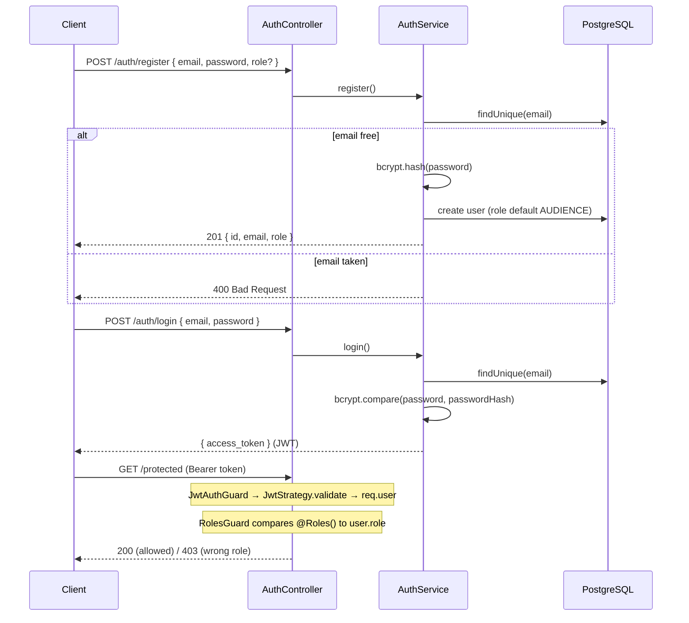

# Auth & RBAC Spec

## Description

Stateless authentication with JWT bearer tokens and role-based access control (RBAC) for
the three roles: `AUDIENCE`, `ORGANIZER`, `SCANNER`. Passwords are hashed with bcrypt and
never stored or returned in plaintext. The signed JWT carries `{ sub, email, role }`, so
every request is authorized without a session/DB lookup. Endpoints opt into protection
declaratively with `@UseGuards(JwtAuthGuard, RolesGuard)` + `@Roles(...)`.

Implemented in `src/backend/src/auth/`.

## Main Flow

1. **Register** — `POST /auth/register` with `{ email, password, role? }`. Service rejects
   duplicate emails, bcrypt-hashes the password (salt generated per user), stores the
   `User`, and returns `{ id, email, role }` (no hash). `role` defaults to `AUDIENCE`.
2. **Login** — `POST /auth/login` with `{ email, password }`. Service loads the user by
   email, `bcrypt.compare`s the password, then signs a JWT `{ sub: user.id, email, role }`
   and returns `{ access_token }`.
3. **Authenticated request** — client sends `Authorization: Bearer <token>`. `JwtAuthGuard`
   (Passport `'jwt'`) triggers `JwtStrategy`, which verifies signature + expiry against
   `JWT_SECRET` and attaches `{ userId, email, role }` to `req.user`.
4. **Authorization** — `RolesGuard` reads `@Roles(...)` metadata via `Reflector`. No
   metadata → any authenticated user passes. Otherwise the request passes only if
   `user.role` is in the required set.

## Error Scenarios

- **Duplicate email on register** → `400 Bad Request` ("This email is existed!").
- **Unknown email or wrong password on login** → `401 Unauthorized` ("Email or password is
  incorrect!"). The same message is used for both cases to avoid user enumeration.
- **Missing / malformed / expired token** on a guarded route → `401 Unauthorized`
  (`ignoreExpiration: false`).
- **Valid token, insufficient role** → `403 Forbidden` (e.g. an `AUDIENCE` token hitting an
  `@Roles(ORGANIZER)` endpoint).

## Constraints

- Passwords are bcrypt-hashed at rest; plaintext is never logged or returned.
- JWT is signed with `JWT_SECRET` from `@nestjs/config`; required on boot.
- Tokens are stateless — there is no server-side session store and (in Week 1) no refresh
  token / revocation list.
- `JwtAuthGuard` must run before `RolesGuard` so `req.user` is populated.
- Concert read APIs (`GET /concerts`, `GET /concerts/:slug`) are intentionally public — no
  guards.

## Acceptance Criteria

- Registering, then logging in as each of the three roles returns a valid JWT whose decoded
  payload contains the correct `role`.
- An `AUDIENCE` token hitting an `@Roles(ORGANIZER)` endpoint returns **403**.
- A request with no/invalid token to a guarded endpoint returns **401**.
- Logging in with a wrong password returns **401** with the generic message.
- Registering with an already-used email returns **400**.
