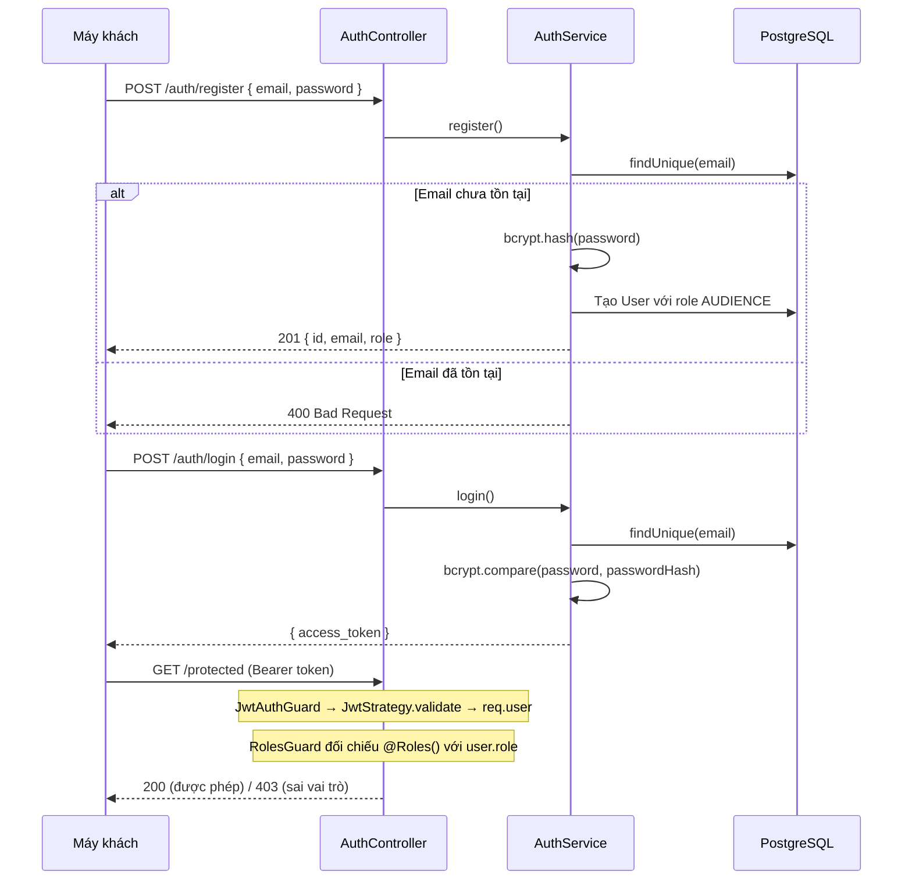

# Đặc tả xác thực và phân quyền RBAC

## Mô tả

Hệ thống sử dụng JWT Bearer không trạng thái và phân quyền theo vai trò (RBAC) với ba vai trò: `AUDIENCE`, `ORGANIZER`, `SCANNER`. Mật khẩu được băm bằng bcrypt và không bao giờ được lưu hay trả về ở dạng văn bản thuần. JWT mang payload `{ sub, email, role }`; các endpoint khai báo bảo vệ bằng `@UseGuards(JwtAuthGuard, RolesGuard)` và `@Roles(...)`.

### Lập luận lựa chọn JWT và RBAC

- JWT được chọn thay server session để Web/PWA dùng cùng REST contract và backend có thể nhân bản không cần sticky session/shared session lookup.
- Đánh đổi là token khó thu hồi tức thời và role có thể cũ đến khi hết hạn. Phạm vi hiện chưa có refresh/revocation; production cần access token ngắn hạn và refresh rotation/revocation, đặc biệt cho `ORGANIZER`/`SCANNER`.
- RBAC phù hợp vì quyền hiện được gom ổn định theo ba vai trò. Nếu sau này quyền phụ thuộc concert cụ thể hoặc thuộc tính tài nguyên, cần bổ sung resource-based policy/ABAC thay vì tạo quá nhiều role.
- UI guard chỉ cải thiện trải nghiệm; API guard mới là security boundary. Client không bao giờ được tự gán role khi đăng ký.

Mã nguồn nằm tại `src/backend/src/auth/`.

## Luồng chính

1. **Đăng ký:** `POST /auth/register` nhận `{ email, password }`. Service từ chối email trùng, băm mật khẩu với salt riêng rồi tạo người dùng. Vì lý do an toàn, tự đăng ký luôn gán vai trò `AUDIENCE`; tài khoản `ORGANIZER` và `SCANNER` được cấp sẵn bằng seed hoặc quy trình quản trị.
2. **Đăng nhập:** `POST /auth/login` nhận `{ email, password }`, so sánh mật khẩu bằng bcrypt, ký JWT `{ sub: user.id, email, role }` và trả `{ access_token }`.
3. **Yêu cầu đã xác thực:** Máy khách gửi `Authorization: Bearer <token>`. `JwtAuthGuard` gọi `JwtStrategy` để kiểm tra chữ ký, hạn dùng bằng `JWT_SECRET`, rồi gắn `{ userId, email, role }` vào `req.user`.
4. **Phân quyền:** `RolesGuard` đọc metadata của `@Roles(...)` qua `Reflector`. Nếu không khai báo metadata, mọi người dùng đã xác thực đều được qua; nếu có, vai trò phải thuộc tập được yêu cầu.

## Ma trận quyền và điểm enforcement

| Khả năng | Khách/chưa đăng nhập | `AUDIENCE` | `ORGANIZER` | `SCANNER` | Enforcement chính |
|---|:---:|:---:|:---:|:---:|---|
| Xem danh sách/chi tiết concert | ✓ | ✓ | ✓ | ✓ | Public API; UI public route |
| Đăng ký/đăng nhập | ✓ | ✓ | ✓ | ✓ | AuthController + rate limit theo IP |
| Tạo order, thanh toán, xem vé của mình | ✗ | ✓ | ✗ | ✗ | JWT + `@Roles(AUDIENCE)` + kiểm tra `order.userId` |
| Quản lý concert/loại vé | ✗ | ✗ | ✓ | ✗ | `/admin/*`: JWT + `@Roles(ORGANIZER)`; admin route guard |
| Upload PDF bio/CSV, xem doanh thu | ✗ | ✗ | ✓ | ✗ | API role guard; UI ẩn/chặn admin page |
| Tải snapshot vé/khách VIP | ✗ | ✗ | ✗ | ✓ | JWT + `@Roles(SCANNER)`; Scanner PWA yêu cầu đăng nhập |
| Đồng bộ check-in/đánh dấu khách VIP | ✗ | ✗ | ✗ | ✓ | API role guard + validation concert/ticket |

### Enforcement theo lớp

1. **API — security boundary:** `JwtAuthGuard` xác minh chữ ký/hạn token và tạo `req.user`; `RolesGuard` đối chiếu `@Roles`; service tiếp tục kiểm tra ownership và state của resource. Sai token trả `401`, đúng token nhưng sai role trả `403`.
2. **Web/admin UI — defense in depth:** route/menu được ẩn hoặc chuyển hướng theo role để tránh thao tác nhầm, nhưng không thay thế kiểm tra API.
3. **Scanner PWA:** chỉ role `SCANNER` được tải snapshot và sync. Snapshot/queue cục bộ phục vụ offline; khi online server vẫn xác thực JWT, role và conditional state transition.
4. **Cấp role:** public registration luôn tạo `AUDIENCE`; `ORGANIZER` và `SCANNER` chỉ được seed/quy trình quản trị cấp, không nhận role từ request client.

## Kịch bản lỗi

- Email đăng ký đã tồn tại → `400 Bad Request` (`This email is existed!`).
- Email không tồn tại hoặc sai mật khẩu → `401 Unauthorized` với cùng thông báo chung để hạn chế dò tài khoản.
- Token thiếu, sai định dạng hoặc hết hạn trên route được bảo vệ → `401 Unauthorized`.
- Token hợp lệ nhưng không đủ vai trò → `403 Forbidden`.

## Ràng buộc

- Không ghi log hoặc trả về mật khẩu thuần hay `passwordHash`.
- JWT được ký bằng `JWT_SECRET` từ `@nestjs/config`.
- Không có session phía máy chủ, refresh token hay danh sách thu hồi token.
- `JwtAuthGuard` phải chạy trước `RolesGuard`.
- `GET /concerts` và `GET /concerts/:slug` cố ý là API công khai.
- Đăng ký công khai không được nhận vai trò do client cung cấp.

## Tiêu chí chấp nhận

- Đăng ký thành công trả người dùng có vai trò `AUDIENCE`; sau đó đăng nhập trả JWT hợp lệ với payload đúng.
- Tài khoản `ORGANIZER` và `SCANNER` được seed có thể đăng nhập và nhận JWT đúng vai trò.
- Token `AUDIENCE` gọi endpoint yêu cầu `ORGANIZER` → `403`.
- Không có token hoặc token không hợp lệ gọi endpoint được bảo vệ → `401`.
- Sai mật khẩu → `401`; email đăng ký trùng → `400`.
