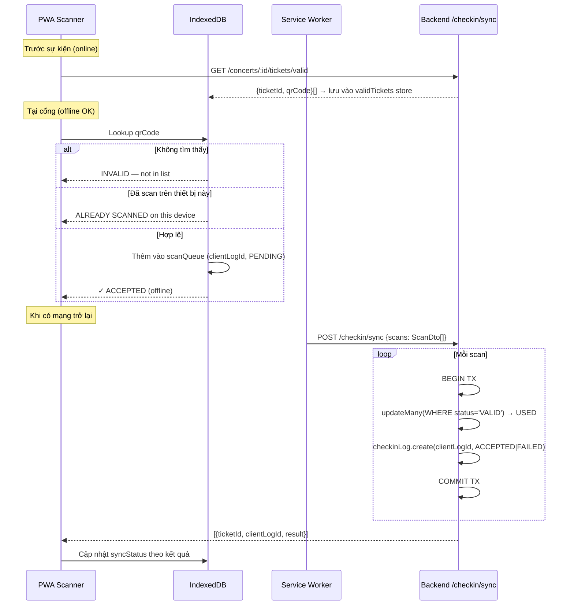

# Đặc tả: Soát vé (Check-in) — Offline-first & Double-scan Prevention

## Mô tả

Nhân sự tại cổng vào dùng **PWA scanner** (React + IndexedDB + Service Worker) để quét mã QR trên e-ticket. Hệ thống phải hoạt động khi không có mạng và tuyệt đối không cho phép một vé vào cổng hai lần.

Double-scan prevention là **2 lớp**:

1. **Cục bộ (thiết bị):** IndexedDB dedup — nếu thiết bị đã scan một vé trong phiên này, chặn ngay lập tức mà không cần kết nối mạng.
2. **Server (đồng bộ):** atomic conditional flip `VALID → USED` trong một DB transaction — chỉ request đầu tiên đến server thành công; các request sau flip 0 dòng và bị từ chối.

---

## Quyết định kỹ thuật: Option A vs Option B

### Option A — Chosen ✅

- **Active guard:** `ticket.updateMany(WHERE status='VALID')` trong transaction — atomic, race-free.
- **Backstop:** partial unique index `one_checkin_per_ticket ON "Ticket"(id) WHERE status='USED'` (added via raw migration `20260624000000_add_double_checkin_constraint`).
- **`CheckinLog`:** append-only, **không có** unique constraint trên `ticketId`. Mỗi lần scan đều được ghi lại (kể cả rejected duplicates) để phục vụ audit trail và demo 2-thiết-bị-offline.

### Option B — Rejected ❌

Partial unique index trên `CheckinLog.ticketId WHERE syncStatus='ACCEPTED'`. Bị loại vì nó ngăn việc ghi log các lần scan bị từ chối, làm mất audit trail cần thiết cho demo.

### Lưu ý trung thực

Index `one_checkin_per_ticket` được đặt trên primary key `"Ticket"(id)`, nên nó là *declarative backstop* (PostgreSQL đảm bảo constraint ở tầng DB) chứ không phải runtime guard thực sự — cơ chế phòng ngừa hoạt động là conditional `updateMany`. Index này quan trọng như một safety net cuối cùng nếu code có bug, và documenting nó rõ ràng trong spec.

---

## Luồng chính

---

## Kịch bản lỗi

| Tình huống | Hành vi |
|---|---|
| Mất mạng khi scan | Vé được ghi vào `scanQueue` (PENDING); hiện "✓ ACCEPTED (offline)"; đồng bộ khi online |
| Scan cùng vé lần 2 trên **cùng thiết bị** | IndexedDB phát hiện ngay (`scanQueue` đã có `ticketId`); hiện "ALREADY SCANNED on this device" — không gọi server |
| Scan cùng vé trên **2 thiết bị khác nhau** (cả 2 offline) | Cả 2 thiết bị chấp nhận cục bộ; khi đồng bộ, thiết bị nào đến server trước được `ACCEPTED`; thiết bị sau nhận `DUPLICATE` và hiện cảnh báo conflict |
| `clientLogId` bị gửi lại (re-sync) | `checkinLog.create` với PK trùng → catch exception → trả về `ALREADY_SYNCED` (idempotent) |
| Vé không tồn tại trong `validTickets` | Scanner từ chối ngay cục bộ ("INVALID"); không bao giờ gọi server với mã QR không hợp lệ |
| Vé đã `USED` trên server (flip 0 dòng) | `syncStatus = FAILED`, trả về `DUPLICATE`; `CheckinLog` vẫn được ghi để audit |

### Giới hạn đã biết

Hai thiết bị **cùng offline** scan cùng một vé **không thể** bị ngăn chặn trong thời gian thực — chỉ phát hiện được khi đồng bộ. Đây là giới hạn cố hữu của hệ thống offline-first, cần trình bày rõ ràng trong video demo.

---

## Ràng buộc

- **Partial unique index:** `"one_checkin_per_ticket" UNIQUE ON "Ticket"(id) WHERE status = 'USED'` — đảm bảo DB-level không thể có 2 row cùng id đều ở trạng thái `USED`.
- **`CheckinLog`:** chỉ có `@@index([ticketId])`, không có unique — mỗi lần scan (kể cả rejected) đều được ghi.
- **`clientLogId`** là UUID do client tạo, dùng làm PK của `CheckinLog` → re-sync cùng batch là idempotent.
- **`DEVICE_ID`** phải được lưu bền vững trên thiết bị (localStorage/IndexedDB) để phân biệt trong audit log.
- Endpoint `POST /checkin/sync` chỉ dành cho role `SCANNER`.
- Mỗi scan trong batch được xử lý trong transaction riêng để lỗi một scan không rollback cả batch.

---

## Tiêu chí chấp nhận

### A1 (Migration + Schema) — Done khi:
- [ ] `npx prisma migrate deploy` chạy thành công trên DB sạch không có lỗi.
- [ ] `\d "Ticket"` trong psql hiển thị index `"one_checkin_per_ticket"` với điều kiện `WHERE (status = 'USED')`.
- [ ] `npx prisma migrate status` báo schema đồng bộ (không có drift warning từ partial index).
- [ ] `npm run seed` chạy thành công sau khi migrate.

### A2 (Sync endpoint) — Done khi:
- [ ] `POST /checkin/sync` với một scan hợp lệ → `ACCEPTED`; `Ticket.status = 'USED'`.
- [ ] Gửi lại cùng `clientLogId` → `ALREADY_SYNCED` (không tạo log mới).
- [ ] Gửi scan thứ 2 cho vé đã `USED` → `DUPLICATE`; `CheckinLog` ghi cả 2 lần.

### A5 (2-device scenario) — Done khi:
- [ ] Thiết bị 1 offline scan vé X → locally accepted.
- [ ] Thiết bị 2 offline scan vé X → locally accepted.
- [ ] Thiết bị 1 online trước, sync → server `ACCEPTED`; `Ticket.status = USED`.
- [ ] Thiết bị 2 online, sync → server `DUPLICATE`; scanner UI hiện conflict warning.
- [ ] `CheckinLog` có đúng 2 entry cho vé X (1 `ACCEPTED`, 1 `FAILED`).
